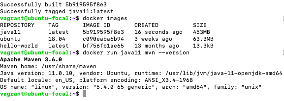
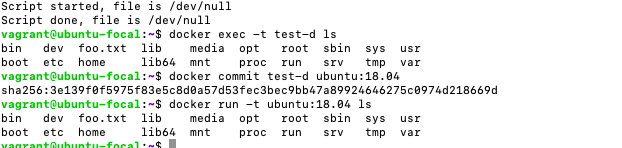

# HW1-DevOps

**Unity Id:** stallur2

**Name:** Sruthi Talluri 

## Class activities

* [ ] Discussion: Describe a situation where it was difficult to run code from someone else

    

    I joined the us-east-1 channel at 2:00 pm on Tuesday(02/02/2021) and discussed about the above topics. 

* [ ] Complete "On your own": Ubuntu up script (10)

    The code for the Ubuntu up script is checked into the respository. Below are the screen shots of App running on localhost and after port forward. 

    
    
    

* [ ] Complete the [CLI notebook](https://docable.cloud/chrisparnin/notebooks/nodejs/CLI/cli.md) 

    Find the sucess output of the code snippets in the notebook below. The code for cli.js can be found checked into the repository. 

    
    
    

    

    

* [ ] Complete "Docker workshop" 

    * Creating the directory structure for the rootfs, downloading the busybox distribution, installing symlinks inside the rootfs, test running of container.
   
     

    * Starting an interactive shell in the container.

     

    * Creating a container.sh file, to create a new snapshot of the filesystem everytime is it launched in order to run the container.

     

    * Installing docer in VM, verifying can run docker

      

    * Checking size of the images

       

    * Creating a simple container.

       

    *  Building the docker image, and name it "java11"

       

    * Looking at all the containers 

       

    * Running in daemon mode and commiting to image

           

    * Using Volumes to share filesystem. 

       

       

### Answer the following conceptual questions 

* Why can code be difficult to run on another machine? 

    We may face various problems of mixing up the environments, and run wrong commands, do not have proper libraries installed on another system, hence unable to resolve dependencies, etc. 

* Explain the concepts of a computing environment and headless infrastructure.

    A headless system is a computer that operates without a monitor, graphical user interface (GUI) or peripheral devices, such as keyboard and mouse, and a the computing environment involves the collection of computer machinary, data storage devices, work stations, software applications, and networks that support the processing and exchange of electronic information demanded by the software solution.  

* Compare full emulation virtualization vs. binary translation

* What are some use cases associated with microvms and unikernels?

* In VM workshop, why can't the eth0 ip address be pinged from the host?

    The issue is that the VM is connected to the network via NAT. We need to set the network adapter of the VM to a bridged connection so that the VM will get it's own IP within the actual network and not on the LAN on the host.

* How can bakerx access the virtual machine through ssh?

    Baker uses a configuration file (baker.yml) in the root directory of our project. Baker uses a small microkernel to host the Ansible configuration server, runc, and provide a host kernel for Baker containers.

* What are the limitations of using chroot for os-virtualization?
    
    chroot context may not stack properly and chrooted programs with sufficient privilages may perform a second chroot to breakout. 

* Why is the builder pattern useful for building images?

# Virtual Machine provisioning with CLI program 

The script for both up.js and ssh.js are available in command folder of the repository. 

#### VM setup

The code for the customization of the VM is available in up.js file from line 101 to 103.

#### Post-Configuration 

The code for the customization of the VM is available in up.js file in the line 110.

#### SSH and App
The code for the customization of the VM is available in ssh.js file.

## Screencast

* Below is the link demonstrating running of code to provision the VM (`v up`), running my customization and post-configuration steps, and ssh (`v ssh`) and a starting your App. It also demonstrates my app running on the browser.

    [Demo](https://drive.google.com/file/d/1QkqfyItlpzhnPVDum2j5j7B_j42D96Ev/view?usp=sharing)
